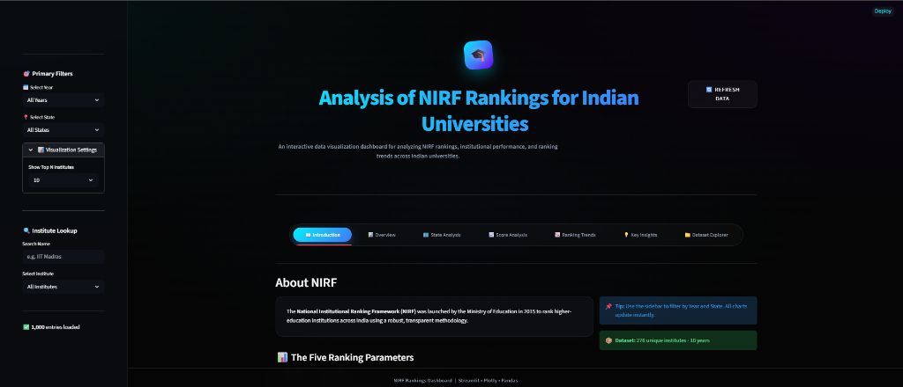
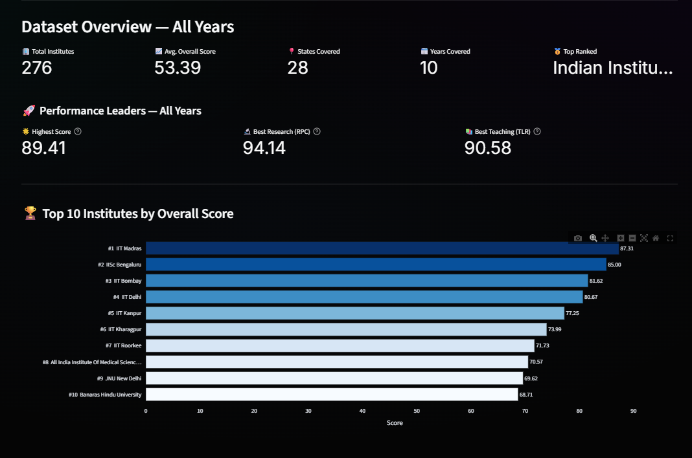
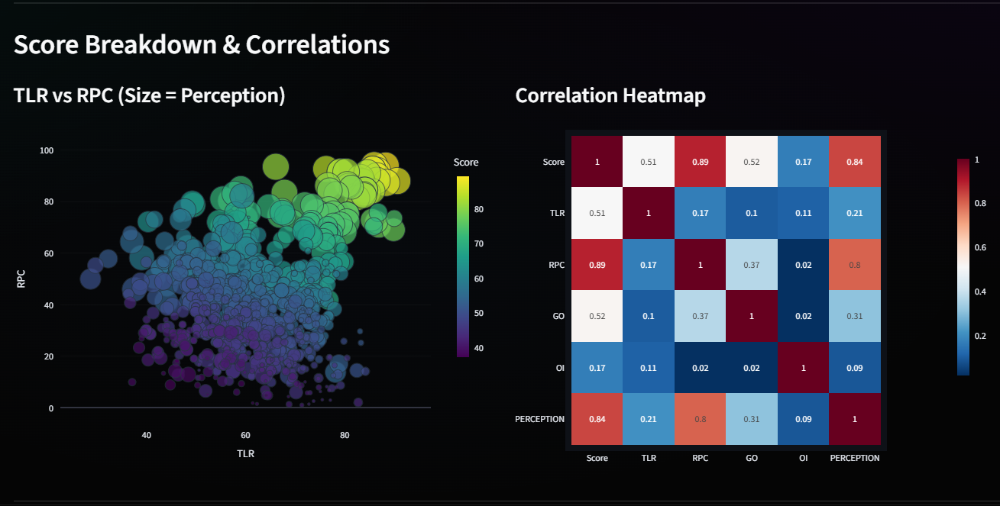
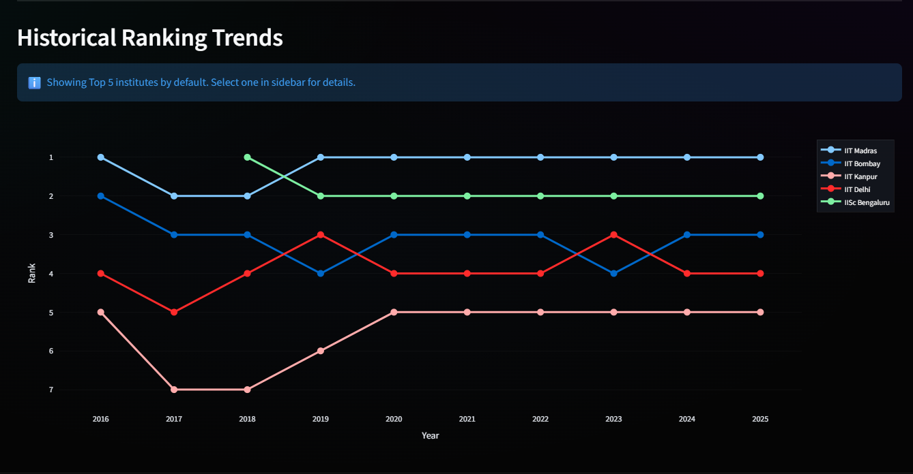
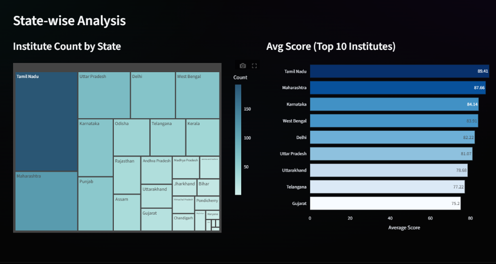

# Analysis of NIRF Rankings for Indian Universities

This project focuses on analyzing the NIRF (National Institutional Ranking Framework) rankings of Indian universities using data visualization and interactive dashboard techniques. The dashboard helps users understand ranking trends, institutional performance, score distribution, and relationships between different ranking parameters through interactive charts and visual analysis.

The project was developed using Python along with libraries such as Pandas, Plotly, Streamlit, and NumPy. By combining ranking data from multiple years, the dashboard provides a simple and user-friendly way to explore institutional rankings and performance patterns.


---

## Features

- Interactive dashboard for NIRF ranking analysis
- Year-wise and state-wise filtering
- Visualization of top-ranked institutions
- Historical ranking trend analysis
- Correlation analysis between ranking parameters
- Distribution analysis using charts and plots
- State-wise comparison of institutions
- Interactive and easy-to-use interface


---

## Technologies Used

- **Python** – Core programming language used for development
- **Pandas** – Used for data cleaning, preprocessing, and analysis
- **Plotly** – Used for creating interactive charts and visualizations
- **Streamlit** – Used for building the interactive dashboard
- **NumPy** – Used for numerical operations and data handling


---

## Dataset Information

The project uses publicly available NIRF ranking datasets collected from multiple years. The dataset contains important institutional and performance-related parameters such as:

- Institute Name
- Rank
- Overall Score
- TLR (Teaching, Learning and Resources)
- RPC (Research and Professional Practice)
- GO (Graduation Outcomes)
- OI (Outreach and Inclusivity)
- Perception Score
- State
- Year


---

## Dashboard Visualizations

The dashboard includes multiple visualization techniques for better analysis and understanding of the dataset:

- Bar Charts
- Scatter Plots
- Heatmaps
- Line Charts
- Histograms
- Box Plots
- Pie Charts


---

## Dashboard Screenshots

### Dashboard Overview


### Performance Overview


### Correlation Analysis


### Ranking Trends


### State Analysis



---

## Project Structure

```bash
nirf-ranking-dashboard/
│
├── data/
├── screenshots/
├── app.py
├── preprocessing.py
├── requirements.txt
└── README.md
```


---

## Installation

Clone the repository:

```bash
git clone https://github.com/your-username/nirf-ranking-dashboard.git
```

Move into the project folder:

```bash
cd nirf-ranking-dashboard
```

Install the required libraries:

```bash
pip install -r requirements.txt
```


---

## Run the Project

Start the Streamlit application using:

```bash
streamlit run app.py
```

The dashboard will open automatically in your browser.


---

## Conclusion

This project demonstrates how data visualization can simplify complex educational ranking data and present meaningful insights through an interactive dashboard. The system provides an easy and effective way to explore NIRF rankings and understand institutional performance across different parameters.